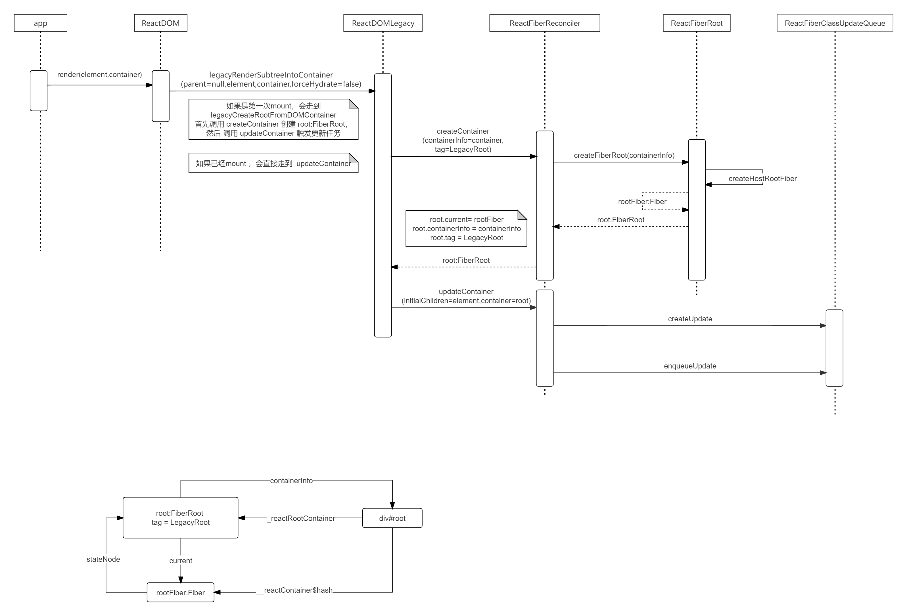
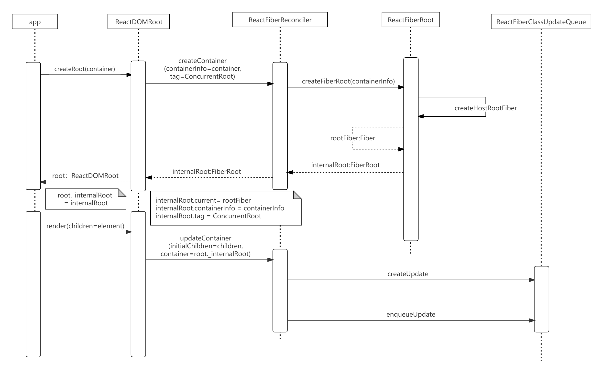
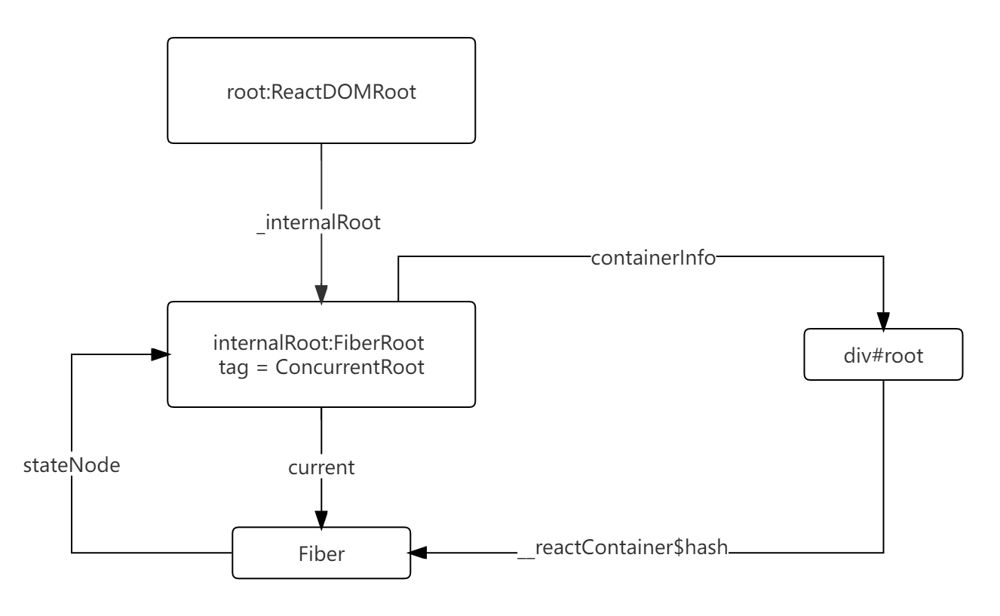
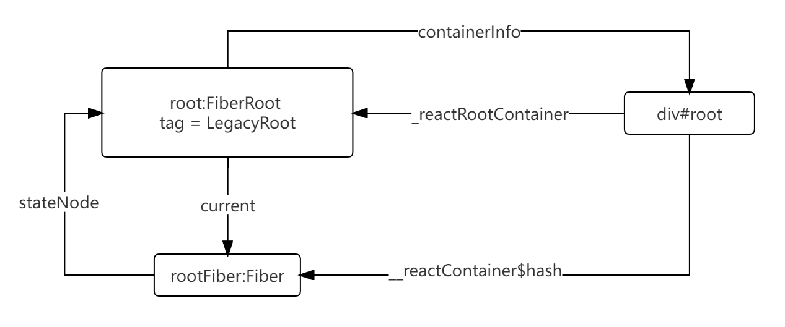

# render

18.x 版本的 react 已经将 `ReactDOM.render(element,container)` 接口建议更换为 `ReactDOM.createRoot(container).render(element)`，除了调用上分成了两个步骤外（其实也不算是啥区别），最重要的是创建的 `FiberNodeRoot` 对象有所区别

首先 `ReactDOM.render` 做的事情也是首先根据 dom container 创建一个 `root` 对象，然后将 `element` 渲染到 `root` 上。`ReactDOM.createRoot(container).render(element)` 将这一个步骤拆分为两块。

可以看这两个时序图：





最大的区别是关于创建的 root 对象：FiberNodeRoot tag 属性，一个是 LegacyRoot,另一个是 ConcurrentRoot。即并发模式的启用。





相关代码可以查看 [ReactDOMLegacy](../react/packages/react-dom/src/client/ReactDOMLegacy.js) 和  [ReactDOMRoot](../react/packages/react-dom/src/client/ReactDOMRoot.js)

结合 [数据结构](./struct.md) 和 这一章节。通过一个实例，说明 Fiber 对象和 DOM 对象是如何关联的：

```jsx
const App = () => (
  <div id='a' key='a'>
    <div id='a-1' key='a-1'>TEST</div>
    <span id='a-2' key='a-2'></span>
  </div>
);
const root = ReactDOM.createRoot(document.getElementById('root'));
root.render(<App />);
```

// TODO: 这里补充一张 Fiber 对象 和 DOM 对象关联关系图