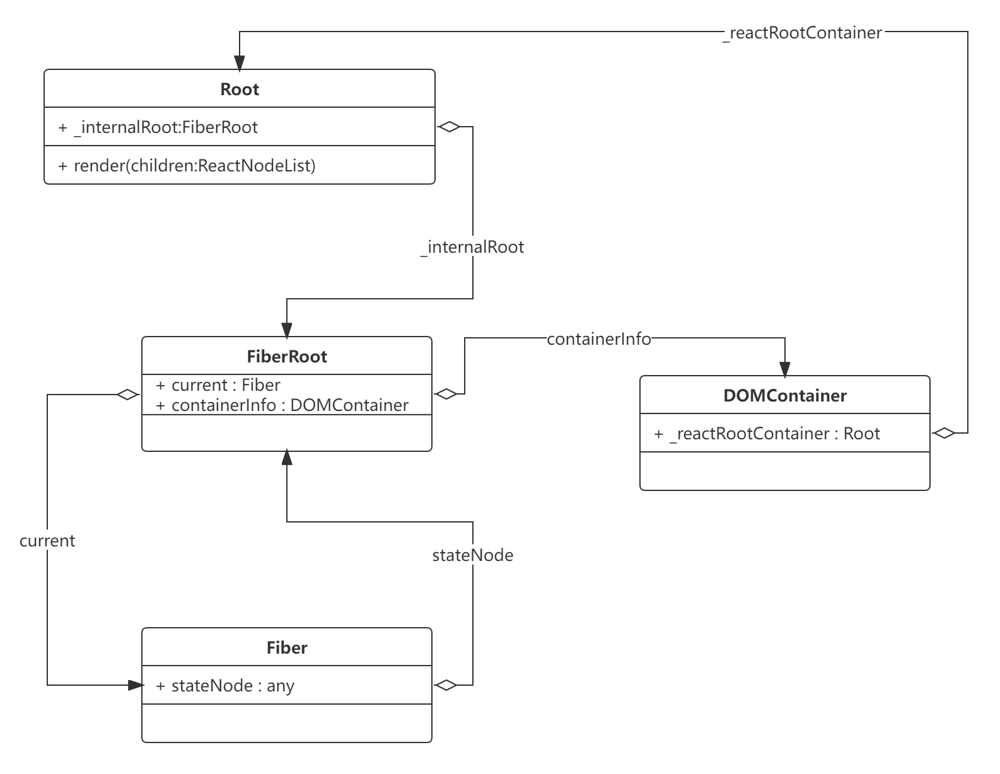
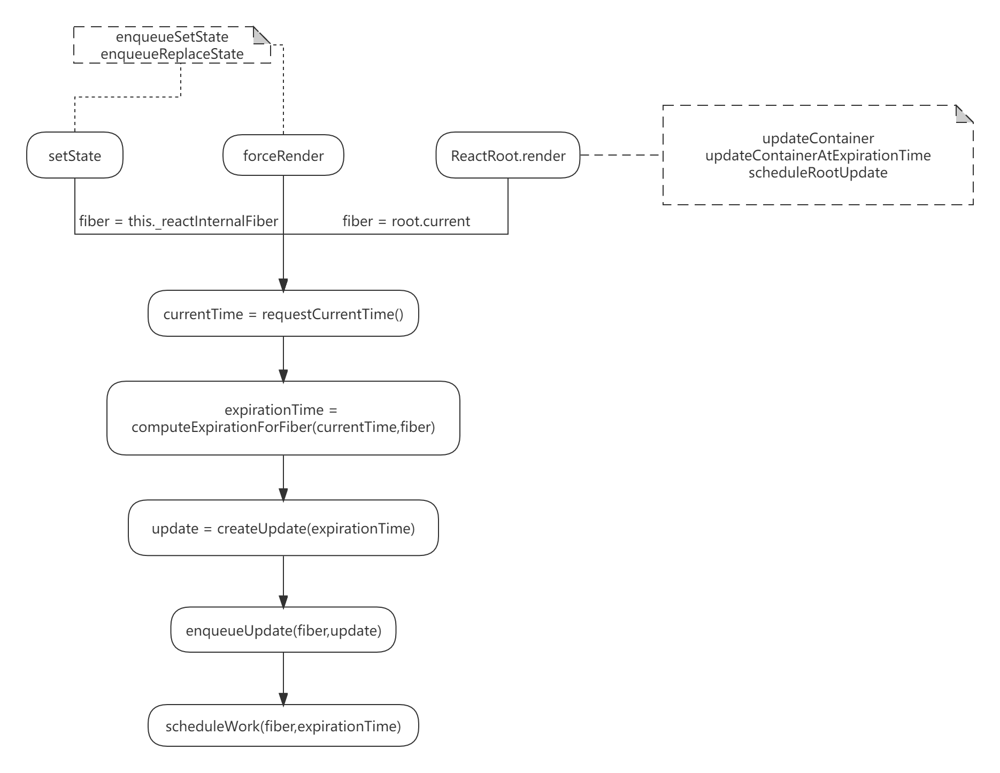

# createUpdate

## ReactDOM.render

[ReactDOM.render](../react/packages/react-dom/src/client/ReactDOM.js#672) 调用的是 [legacyRenderSubtreeIntoContainer](../react/packages/react-dom/src/client/ReactDOM.js#540)

legacyRenderSubtreeIntoContainer:

如果是 Initial mount , Root 节点 还没有创建 需要调用 [legacyCreateRootFromDOMContainer](../react/packages/react-dom/src/client/ReactDOM.js#495) 创建 [root](../react/packages/react-dom/src/client/ReactDOM.js#537),这个过程实际上是构建下面这样一个结构：



然后调用 [root.render(element)](../react/packages/react-dom/src/client/ReactDOM.js#373) 创建渲染更新任务，等待将 vdom 渲染到 `root._internalRoot.containerInfo`这个 DOM上

创建更新任务的过程 经过 方法

* [updateContainer](../react/packages/react-reconciler/src/ReactFiberReconciler.js#283)
* [updateContainerAtExpirationTime](../react/packages/react-reconciler/src/ReactFiberReconciler.js#162)
* [scheduleRootUpdate](../react/packages/react-reconciler/src/ReactFiberReconciler.js#115)

最终走到 [scheduleWork](../react/packages/react-reconciler/src/ReactFiberScheduler.js#1851)

## setState forceRender

同样类似的 [setState 和 forceRender](../react/packages/react/src/ReactBaseClasses.js) 也是 类似的[实现逻辑](../react/packages/react-reconciler/src/ReactFiberClassComponent.js)

```js
enqueueSetState(inst, payload, callback) {
  const fiber = getInstance(inst); // element._reactInternalFiber
  const currentTime = requestCurrentTime();
  const expirationTime = computeExpirationForFiber(currentTime, fiber);
  const update = createUpdate(expirationTime);
  update.payload = payload;
  if (callback !== undefined && callback !== null) {
    update.callback = callback;
  }
  flushPassiveEffects();
  enqueueUpdate(fiber, update);
  scheduleWork(fiber, expirationTime);
}
```

综上 我们得到这样一张图，接下来我们一次分析 render/setState/forceUpdate 调用的几个关键方法，看下是如何创建更新任务的



## requestCurrentTime

[requestCurrentTime](../react/packages/react-reconciler/src/ReactFiberScheduler.js#2040)

React 使用 currentTimeMs 转化为 ExpirationTime ，用来表示任务的 **`优先级`**，之所以使用优先级而不是过期时间，根据最新(16.8.x)的 requestCurrentTime 的实现，优先级更为合适，表示为 ExpirationTime 的 currentTime 越大，表示任务优先级越高。

```js
0 - NoWork
1 - Never
...
big - low pri things
even bigger - hi pri things
max 31-bit int - Sync
```

也就是发生的更新越早，优先级越高。

这涉及到几次调整 ： https://github.com/facebook/react/pull/13912 ，https://github.com/facebook/react/pull/13904

## computeExpirationForFiber

计算 expirationTime : [computeExpirationForFiber](../react/packages/react-reconciler/src/ReactFiberScheduler.js#1595)

通过 currentTime 计算 expirationTime ，将 currentTime 按照 bucket size(bucketSizeMs) 和 expiration(expirationInMs) 落到不同的 buckets，其目的是让时间临近的一批更新，可以得到相同的expiration time，即实现批量更新。

还有就是交互触发的更新，拥有更小的 bucket size 和 expiration，会让这类更新调度更加频繁

## enqueueUpdate

[enqueueUpdate](../react/packages/react-reconciler/src/ReactUpdateQueue.js#220)

创建更新，将更新添加到 fiber.updateQueue 等待被调度到 这个 fiber 的时候执行。

```js
appendUpdateToQueue(fiber.updateQueue, update);
```

## scheduleWork

[scheduleWork](../react/packages/react-reconciler/src/ReactFiberScheduler.js#1851)

```js
function scheduleWork(fiber: Fiber, expirationTime: ExpirationTime) {
  // 找到 fiber 的 root 节点
  const root = scheduleWorkToRoot(fiber, expirationTime);
  // TIPS: 
  // 当前没有work 在执行render 或者 commit 阶段为 true) 
  // nextRenderExpirationTime !== NoWork 下个 RenderExpirationTime(renderRoot 时 会设置为 root 的expirationTime,结束后设置为 NoWork)
  // 新任务额优先级高于当前渲染任务 expirationTime > nextRenderExpirationTime
  // 保存当前的 Stack
  if (!isWorking && nextRenderExpirationTime !== NoWork && expirationTime > nextRenderExpirationTime) {
    // This is an interruption.
    interruptedBy = fiber;
    resetStack();
  }
  markPendingPriorityLevel(root, expirationTime);
  // If we're in the render phase, we don't need to schedule this root
  // for an update, because we'll do it before we exit...、
  // ...unless this is a different root than the one we're rendering.
  // !isWorking || isCommitting 实际上表示 render 阶段
  if (!isWorking || isCommitting || nextRoot !== root 
  ) {    
    const rootExpirationTime = root.expirationTime;
    // 请求调度 root
    requestWork(root, rootExpirationTime);
  }
}
```

接下来分别看下 `scheduleWorkToRoot` `markPendingPriorityLevel` `requestWork` 分别做了什么东西。

### scheduleWorkToRoot

```js
function scheduleWorkToRoot(fiber: Fiber, expirationTime): FiberRoot | null {
  // Update the source fiber's expiration time
  if (fiber.expirationTime < expirationTime) {
    fiber.expirationTime = expirationTime;
  }
  let alternate = fiber.alternate;
  if (alternate !== null && alternate.expirationTime < expirationTime) {
    alternate.expirationTime = expirationTime;
  }
  // Walk the parent path to the root and update the child expiration time.
  let node = fiber.return;
  let root = null;
  if (node === null && fiber.tag === HostRoot) { // 说明 fiber 是最顶层节点了 对应的 stateNode 就是 fiberRoot
    root = fiber.stateNode;
  } else {
    while (node !== null) {
      alternate = node.alternate;
      // 更新 node 的 childExpirationTime 用于快速判断 一个 fiber node 子树上是否有需要执行的任务
      if (node.childExpirationTime < expirationTime) {
        node.childExpirationTime = expirationTime;
        if (
          alternate !== null &&
          alternate.childExpirationTime < expirationTime
        ) {
          alternate.childExpirationTime = expirationTime;
        }
      } else if (
        alternate !== null &&
        alternate.childExpirationTime < expirationTime
      ) {
        alternate.childExpirationTime = expirationTime;
      }
      if (node.return === null && node.tag === HostRoot) {
        root = node.stateNode;
        break;
      }
      node = node.return;
    }
  }
  return root;
}
```

### markPendingPriorityLevel

更新 root 上 的 earliestPendingTime 和  latestPendingTime

```js
if (earliestPendingTime < expirationTime) {
  // This is the earliest pending update.
  root.earliestPendingTime = expirationTime;
} else {
  const latestPendingTime = root.latestPendingTime;
  if (latestPendingTime > expirationTime) {
    // This is the latest pending update
    root.latestPendingTime = expirationTime;
  }
}
```

更新 earliestPendingTime 和  latestPendingTime 后，还需要调用 findNextExpirationTimeToWorkOn ，根据

```js
const earliestSuspendedTime = root.earliestSuspendedTime;
const latestSuspendedTime = root.latestSuspendedTime;
const earliestPendingTime = root.earliestPendingTime;
const latestPingedTime = root.latestPingedTime;
```

更新 root 上的 expirationTime 和 nextExpirationTimeToWorkOn

## requestWork

```js
function requestWork(root: FiberRoot, expirationTime: ExpirationTime) {
  addRootToSchedule(root, expirationTime)
  if (isRendering) {
    // Prevent reentrancy. Remaining work will be scheduled at the end of
    // the currently rendering batch.
    // 如果正在渲染 则不需要调度 因为当前已经在执行 root 上的任务了
    // 等待当前任务执行完 会执行当前添加的任务
    return;
  }

  if (expirationTime === Sync) {
    // 同步执行
    performSyncWork()
  } else {
    // 交给 scheduler 调度
    scheduleCallbackWithExpirationTime(root, expirationTime) // => performAsyncWork
  }
}

function addRootToSchedule(root: FiberRoot, expirationTime: ExpirationTime) {
  // Add the root to the schedule.
  // Check if this root is already part of the schedule.
  if (root.nextScheduledRoot === null) {
    // This root is not already scheduled. Add it.
    root.expirationTime = expirationTime
    if (lastScheduledRoot === null) {
      firstScheduledRoot = lastScheduledRoot = root
      root.nextScheduledRoot = root
    } else {
      lastScheduledRoot.nextScheduledRoot = root
      lastScheduledRoot = root
      lastScheduledRoot.nextScheduledRoot = firstScheduledRoot
    }
  } else {
    // This root is already scheduled, but its priority may have increased.
    const remainingExpirationTime = root.expirationTime
    if (
      remainingExpirationTime === NoWork ||
      expirationTime < remainingExpirationTime
    ) {
      // Update the priority.
      root.expirationTime = expirationTime
    }
  }
}
```

`scheduleCallbackWithExpirationTime` ,是将 fiberRoot 交给 Scheduler（可以参看 [Scheduler](./Scheduler.md)）

```js
function scheduleCallbackWithExpirationTime(
  root: FiberRoot,
  expirationTime: ExpirationTime,
) {
  if (callbackExpirationTime !== NoWork) {
    // A callback is already scheduled. Check its expiration time (timeout).
    if (expirationTime < callbackExpirationTime) {
      // Existing callback has sufficient timeout. Exit.
      return;
    } else {
      if (callbackID !== null) {
        // Existing callback has insufficient timeout. Cancel and schedule a
        // new one.
        cancelDeferredCallback(callbackID);
      }
    }
    // The request callback timer is already running. Don't start a new one.
  } else {
    startRequestCallbackTimer();
  }

  callbackExpirationTime = expirationTime;
  const currentMs = now() - originalStartTimeMs;
  const expirationTimeMs = expirationTimeToMs(expirationTime);
  const timeout = expirationTimeMs - currentMs;
  // react\packages\react-dom\src\client\ReactDOMHostConfig.js
  // import {
  // unstable_scheduleCallback as scheduleDeferredCallback,
  // unstable_cancelCallback as cancelDeferredCallback,
  // } from 'scheduler';
  callbackID = scheduleDeferredCallback(performAsyncWork, {timeout});
}
```
